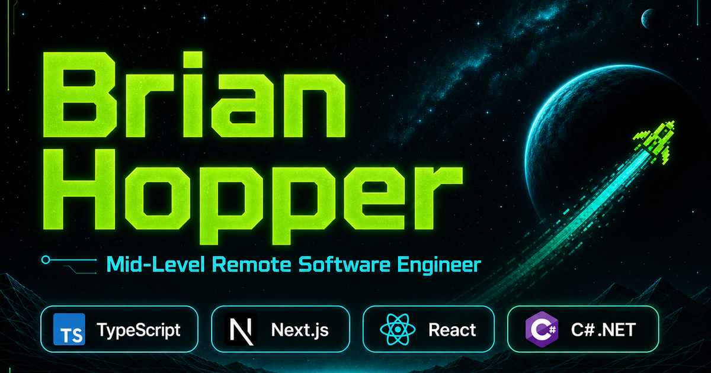

# 🚀 Brian Hopper's Interactive Portfolio

<div align="center">


**A unique, interactive portfolio featuring a Galaga-style game navigation system!**

[🌐 Live Site](https://sparkly-cranachan-9f0864.netlify.app) • [🎮 Game Mode](#-game-mode) • [📖 Features](#-features) • [🛠️ Installation](#️-installation) • [📱 Screenshots](#-screenshots)

</div>

---

## 📑 Table of Contents

- [✨ Features](#-features)
- [🎮 Game Mode](#-game-mode)
- [🛠️ Tech Stack](#️-tech-stack)
- [📦 Installation](#-installation)
- [🚀 Usage](#-usage)
- [📱 Mobile & Tablet Support](#-mobile--tablet-support)
- [🌐 Live Site](#-live-site)
- [📸 Screenshots](#-screenshots)
- [💼 Professional Experience](#-professional-experience)
- [🏗️ Project Structure](#️-project-structure)
- [📧 Contact](#-contact)
- [🎓 Education & Certifications](#-education--certifications)
- [🛠️ Skills & Technologies](#️-skills--technologies)
- [🔒 Security](#-security)
- [📄 License](#-license)

---

## ✨ Features

### 🎯 Core Features

- **🎮 Interactive Game Navigation** - Navigate your portfolio by playing a Galaga-style space shooter game
- **📱 Fully Responsive** - Optimized for desktop, tablet, and mobile devices
- **👆 Touch Controls** - Full touch support for mobile and tablet users
- **🎨 Modern UI/UX** - Dark space theme with neon accents and smooth animations
- **📧 Contact Form** - Integrated EmailJS for direct email sending
- **📄 Resume Download** - Easy access to downloadable resume PDF

### 🎮 Game Mode Features

- **🛸 Starship Control** - Move your ship with keyboard arrows or mouse/touch
- **💥 Shooting Mechanics** - Shoot projectiles to navigate between sections
- **👾 Enemy Navigation** - Each navigation target requires 5 hits to activate
- **🎨 Decorative Aliens** - Moving alien ships for target practice
- **💫 Starfield Background** - Animated scrolling starfield
- **💥 Explosion Effects** - Visual feedback for hits and collisions
- **⚡ Game Over** - Collision detection with "You Died" message

### 🎨 Design Features

- **🌌 Space Theme** - Dark backgrounds with neon cyan and green accents
- **✨ Animations** - Smooth transitions and hover effects
- **🎯 Custom Button Shapes** - Game-themed octagonal and spaceship-shaped buttons
- **📊 Card Layouts** - Modern card-based design for projects and skills
- **🎭 Hero Animation** - Animated Galaga-style scene in hero section

---

## 🎮 Game Mode

### How to Play

1. **Activate Game Mode** - Click the "Game Mode" button in the header
2. **Control Your Ship**:
   - **Desktop**: Use arrow keys or move your mouse
   - **Mobile/Tablet**: Touch and drag to move
3. **Shoot**:
   - **Desktop**: Press Spacebar or click
   - **Mobile/Tablet**: Tap anywhere on screen
4. **Navigate**: Shoot navigation enemies 5 times to navigate to that section
5. **Avoid Collisions**: Touching any enemy ship ends the game!

### Game Controls

| Control | Desktop | Mobile/Tablet |
|---------|---------|---------------|
| Move | Arrow Keys / Mouse | Touch & Drag |
| Shoot | Spacebar / Click | Tap Screen |
| Exit | "Exit Game" Button | "Exit Game" Button |

---

## 🛠️ Tech Stack

### Frontend
- **React 18.3.1** - UI framework
- **Vite 5.4.12** - Build tool and dev server
- **PrimeReact 10.9.7** - UI component library
- **PrimeIcons 7.0.0** - Icon library
- **React Icons 5.4.0** - Additional icons
- **React Helmet 6.1.0** - Document head management

### Backend/Integration
- **EmailJS 4.4.1** - Email service integration

### Development Tools
- **ESLint** - Code linting
- **Vite Plugin React** - React support for Vite

### Key Technologies
- **HTML5 & CSS3** - Modern web standards
- **JavaScript ES6+** - Modern JavaScript features
- **Canvas API** - Game rendering
- **CSS Animations** - Smooth transitions and effects
- **Responsive Design** - Mobile-first approach

---

## 📦 Installation

### Prerequisites

- Node.js (v16 or higher recommended)
- npm or yarn package manager

### Steps

1. **Clone the repository**
   ```bash
   git clone https://github.com/GrassHopper12345/reactPortfolio.git
   cd reactPortfolio
   ```

2. **Install dependencies**
   ```bash
   npm install
   ```

3. **Set up environment variables** (for EmailJS)
   
   Create a `.env` file in the root directory:
   ```env
   VITE_EMAILJS_PUBLIC_KEY=your_public_key_here
   VITE_EMAILJS_SERVICE_ID=your_service_id_here
   VITE_EMAILJS_TEMPLATE_ID=your_template_id_here
   ```

4. **Start the development server**
   ```bash
   npm run dev
   ```

5. **Open your browser**
   - The app will automatically open at `http://localhost:3000`

---

## 🚀 Usage

### Development

```bash
# Start development server
npm run dev

# Build for production
npm run build

# Preview production build
npm run preview

# Run linter
npm run lint
```

### Production Build

```bash
npm run build
```

The built files will be in the `dist` directory, ready for deployment.

---

## 📱 Mobile & Tablet Support

### Touch Controls
- **Touch to Move** - Drag your finger to control the starship
- **Tap to Shoot** - Tap anywhere on screen to fire projectiles
- **Responsive Layout** - Navigation enemies stack vertically on mobile
- **Touch-Friendly Buttons** - All buttons meet iOS 44px minimum touch target

### Responsive Breakpoints
- **Desktop**: Full two-column layout with side-by-side content
- **Tablet (≤980px)**: Adjusted spacing and font sizes
- **Mobile (≤768px)**: Stacked layout, optimized touch targets
- **Small Mobile (≤575px)**: Compact layout with centered content

---

## 🌐 Live Site

**Visit the live portfolio:** [https://sparkly-cranachan-9f0864.netlify.app](https://sparkly-cranachan-9f0864.netlify.app)

Experience the interactive game navigation and explore all portfolio sections!

---

## 🔗 LinkedIn Link Preview

This portfolio uses **static Open Graph and Twitter meta tags** in the HTML head to ensure proper link previews on LinkedIn, Twitter, and other social platforms. LinkedIn does not execute JavaScript, so static tags in `index.html` are required.

### Preview Image

- **Location:** `/public/preview.png`
- **Size:** 1200×630 pixels (Open Graph standard)
- **Status:** Configured — used for LinkedIn, Twitter, and Slack link previews

### Refreshing LinkedIn Cache

After deploying updates to the preview image or meta tags:

1. Use [LinkedIn Post Inspector](https://www.linkedin.com/post-inspector/) to refresh the cache
2. Enter your site URL: `https://sparkly-cranachan-9f0864.netlify.app`
3. Click "Inspect" to update LinkedIn's cached preview

> **Tip:** A custom domain (e.g. `brianhopper.dev`) looks more professional than the default Netlify subdomain when sharing your portfolio with recruiters.

### Meta Tags Included

- Open Graph tags (og:title, og:description, og:image, og:url, og:type)
- Twitter Card tags (twitter:card, twitter:title, twitter:description, twitter:image)
- Canonical URL
- Robots meta tag

---

---

## 📸 Screenshots

| Preview | Description |
|---------|-------------|
|  | Link preview image (1200×630) for LinkedIn and Twitter |

### Portfolio sections

- **Hero** — Recruiter quick-scan with role, stack, and CTAs
- **About** — Bio, profile photo, and Galaga hero animation
- **Projects** — Case-study cards with GitHub links and tech stacks
- **Experience** — Professional work history at CityTeleCoin
- **Skills** — Current production-focused stack
- **Experiments** — Optional Galaga game navigation (standard nav always available)
- **Contact** — EmailJS form with direct email and social links

### Game mode

Galaga-style navigation is **opt-in** via the Experiments section. Standard header navigation is always available for recruiters and mobile users.

---

## 🏗️ Project Structure

```
reactPortfolio/
├── public/
│   ├── Resume.pdf
│   └── vite.svg
├── src/
│   ├── assets/
│   │   ├── profilePic/
│   │   ├── projectPics/
│   │   └── files/
│   ├── components/
│   │   ├── About/
│   │   ├── Contact/
│   │   ├── Footer/
│   │   ├── GameNavigation/
│   │   │   ├── DecorativeAlien.jsx
│   │   │   ├── Enemy.jsx
│   │   │   ├── GameCanvas.jsx
│   │   │   ├── index.jsx
│   │   │   ├── Projectile.jsx
│   │   │   └── Starship.jsx
│   │   ├── Header/
│   │   ├── HeroAnimation/
│   │   ├── Navi/
│   │   ├── Portfolio/
│   │   └── Resume/
│   ├── styles/
│   │   └── game.css
│   ├── utils/
│   │   ├── gameUtils.js
│   │   └── helpers.js
│   ├── App.jsx
│   ├── App.css
│   ├── index.css
│   └── main.jsx
├── .env
├── index.html
├── package.json
├── vite.config.js
└── README.md
```

### Key Components

- **GameNavigation** - Main game logic and rendering
- **HeroAnimation** - Animated Galaga scene
- **About** - Personal introduction and domain background
- **Portfolio** - Project showcase with case-study cards
- **Experience** - Professional work history
- **Skills** - Current production-focused technology stack
- **Contact** - Contact form with EmailJS integration

---

## 🎯 Key Features Breakdown

### Game Navigation System
- Real-time collision detection
- Projectile physics
- Enemy health system (5 hits required)
- Explosion particle effects
- Starfield background animation
- Touch and keyboard controls

### UI/UX Enhancements
- Custom button shapes with clip-path
- Neon glow effects
- Smooth animations and transitions
- Responsive grid layouts
- Dark theme with space aesthetics

### Contact Integration
- EmailJS for direct email sending
- Form validation
- Success/error messaging
- Fallback to mailto: protocol

---

## 💼 Professional Experience

### Software Engineer & Project Lead — CityTeleCoin
**Jun 2022 – Present** · Bossier City, LA (Remote)

Technical lead and project manager for a multi-client corrections administrative platform — 4 React/Next.js frontends on a shared TypeScript monorepo, backed by a .NET 9 REST API, with kiosk hardware integration and full DevOps delivery. Earlier production work at CityTeleCoin includes a native Android inmate kiosk app and a legacy PHP customer payment portal.

- Lead a multi-client administrative platform for correctional facilities — admin dashboard, inmate kiosk, visitation kiosk, and mobile public portal — targeting production launch
- Serve as technical lead and project manager: Jira backlog prioritization, sprint planning, stakeholder alignment, Bitbucket PR reviews, Jenkins CI/CD, and cross-team coordination
- Build enterprise UI with **PrimeReact**, **TanStack Query/Table**, **React Hook Form**, and **Zustand** across desktop admin and touch-first kiosk form factors
- Integrate frontends via **OpenAPI-generated TypeScript clients**, facility-scoped permissions, and multi-tenant data access
- Modernized a production **Android (Kotlin) inmate kiosk app** — RecyclerView + View Binding migration, English/Spanish i18n, **TalkBack** accessibility, and multi-generation hardware bug fixes
- Led WCAG accessibility remediation across **15+ customer-facing PHP pages** for a correctional telecom payment portal — validated with **Lighthouse (100% accessibility)** and **WAVE**
- Drive release readiness with **Playwright** E2E tests, **Vitest** unit tests, and **Node.js** kiosk daemon integration; earlier, resolved production payment-flow bugs in multi-step checkout for a system processing real financial transactions

**Stack:** TypeScript · Next.js · React · Kotlin · Android SDK · PrimeReact · TanStack Query · .NET 9 · PostgreSQL · Redis · Docker · Kubernetes · Jenkins · Bitbucket · Jira · AWS · Playwright · PHP · TalkBack · i18n

---

## 📧 Contact

**Brian Hopper**

- 📍 Location: Bossier City, LA
- 📧 Email: [brian.hopper@live.com](mailto:brian.hopper@live.com)
- 📱 Phone: [318.773.4013](tel:318.773.4013)
- 💼 LinkedIn: [Brian Hopper](https://www.linkedin.com/in/mrhopper/)
- 🐙 GitHub: [GrassHopper12345](https://github.com/GrassHopper12345)

---

## 🎓 Education & Certifications

- **B.A. in Cellular and Molecular Biology** - Louisiana State University Shreveport
- **Masters in Health Science** - Louisiana State University Shreveport
- **MBA in Project Management** - Louisiana State University Shreveport
- **Lean Six Sigma Green Belt** - Certified
- **Lean Practitioner** - Certified
- **Scrum Master** - Certified
- **Six Sigma Black Belt** - Certified

---

## 🛠️ Skills & Technologies

Skills below reflect **current production and professional work** on the administrative platform. This portfolio repo is built with **React, Vite, and JavaScript**; day-to-day engineering uses **TypeScript, Next.js, and .NET 9**.

### Frontend
- TypeScript, React, Next.js, PrimeReact, Tailwind CSS, Zustand, TanStack Query/Table, React Hook Form, Vite, Axios, Kotlin, Android SDK, RecyclerView, View Binding

### Backend & APIs
- .NET 9, REST APIs, OpenAPI/Swagger, Entity Framework Core, Hangfire, Node.js (kiosk daemon), PHP, jQuery

### Data & Platform
- PostgreSQL, Redis, multi-tenant data modeling, MongoDB

### DevOps & Process
- Docker, Kubernetes, Jenkins, Bitbucket, Jira, AWS, CI/CD

### Testing & Leadership
- Playwright, Vitest, Agile/Scrum, sprint planning, code reviews, WCAG 2.1, ARIA, Lighthouse, TalkBack, i18n/localization, technical leadership, accessibility

### Portfolio site (this repo)
- React 18, Vite, PrimeReact, Canvas API, EmailJS, ESLint, responsive CSS

---

## 🚧 Future Enhancements

- [ ] Add sound effects to game mode
- [ ] High score tracking system
- [ ] Multiple difficulty levels
- [ ] Additional game modes
- [ ] Blog section
- [ ] Project filtering and search
- [ ] Dark/light theme toggle
- [ ] Accessibility improvements

---

## 🤝 Contributing

Contributions are welcome! Please feel free to submit a Pull Request.

1. Fork the project
2. Create your feature branch (`git checkout -b feature/AmazingFeature`)
3. Commit your changes (`git commit -m 'Add some AmazingFeature'`)
4. Push to the branch (`git push origin feature/AmazingFeature`)
5. Open a Pull Request

---

## 🔒 Security

Do not commit `.env` files. Use `.env.example` as a template and set real values locally and in Netlify environment variables.

If credentials were ever exposed in git history, rotate them immediately. See [SECURITY.md](./SECURITY.md) for details.

---

## 📄 License

This project is licensed under the MIT License - see the [LICENSE](LICENSE) file for details.

---

## 🙏 Acknowledgments

- **PrimeReact** - For the excellent UI component library
- **EmailJS** - For email service integration
- **React Icons** - For beautiful icon sets
- **Vite** - For the lightning-fast build tool

---

<div align="center">

**Built with ❤️ by Brian Hopper**

⭐ Star this repo if you find it interesting!

[⬆ Back to Top](#-brian-hoppers-interactive-portfolio)

</div>
